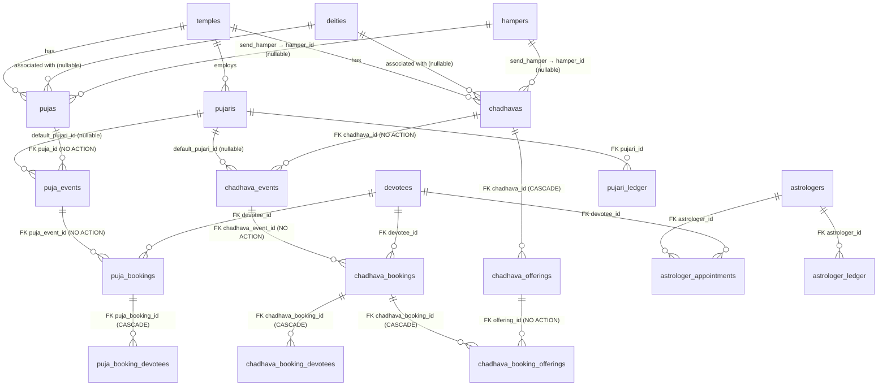
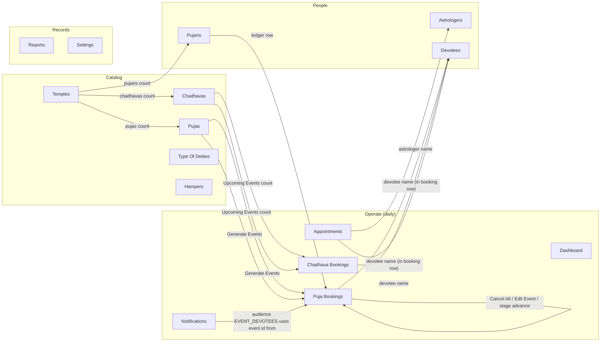

# Bookings & CRUD — Entity Reference

**Audience:** any admin-panel handler maintaining live Savidhi bookings. Read this once and you can confidently operate the panel without breaking active bookings.

**Authoritative as of** the 15-May-2026 launch (migrations 001 → 016).

---

## 1. Entity diagram



The critical edge is `puja_bookings → puja_events` (and the chadhava counterpart): `NO ACTION` on delete. The booking row preserves history even if an admin tries to delete the parent event — the FK rejects the delete instead of cascading. This is intentional.

---

## 2. Entity reference

### `pujas` *(template)*
- **Purpose:** the offering itself — name, price tiers, video, schedule + repeat intent.
- **Created when:** admin creates a puja in `/dashboard/pujas`.
- **Mutated when:** admin edits the puja form, or seed migrations run.
- **Terminal state:** soft-delete via `is_active = false`. Hard-deletable only if no future bookings exist on its events.
- **Key columns:** `name`, `temple_id`, `deity_id` (nullable), `default_pujari_id` (nullable), `event_repeats`, `repeat_duration` (enum WEEK_DAYS|MONTH_DATE|LUNAR_PHASE), `repeats_on` (text[]), `schedule_time`, `start_date`, `price_for_1/2/4/6`, `max_devotee`, `shlok` *(new — read-only text shown to devotees on booking flow)*, `shlok_hi`.

### `chadhavas` *(template)*
- Mirror of `pujas`. Differences: no per-devotee price tiers; pricing comes from nested `chadhava_offerings` rows (each with `item_name`, `price`, etc.); chadhava events have no shipping stage. `shlok` + `shlok_hi` columns added in migration 015.

### `puja_events` *(materialized occurrence)*
- **Purpose:** one specific date+time the puja will happen.
- **Created when:**
  - Admin clicks **Generate Events** on a puja (bulk, idempotent via unique `(puja_id, start_time)`),
  - or admin creates a single one-off event from `/dashboard/puja-bookings → Add Event`.
  - There is **no cron**. Templates don't auto-materialize.
- **Mutated when:** stage advance, metadata edit (pujari/start_time/max_bookings), cancel-all-bookings flow.
- **Terminal state:** stage `SHIPPED` (auto-sets `status = 'COMPLETED'`). DELETE allowed only if zero bookings ever existed (FK + guard).
- **Key columns:** `id`, `puja_id`, `pujari_id`, `start_time`, `max_bookings`, `status` (NOT_STARTED|INPROGRESS|COMPLETED), `stage` (YET_TO_START|LIVE_ADDED|SHORT_VIDEO_ADDED|SANKALP_VIDEO_ADDED|TO_BE_SHIPPED|SHIPPED), `live_link`, `short_video_url`, `sankalp_video_url`.

### `chadhava_events`
- Mirror of `puja_events` but the stage machine terminates at `COMPLETED` after `SANKALP_VIDEO_ADDED` (no shipping — per chadhava_no_ship migration 008).

### `puja_bookings`
- **Purpose:** one devotee's seat in one event.
- **Created when:** devotee POSTs `/bookings/puja-bookings { puja_event_id, devotees[], devotee_count, prasad_delivery_address? }`. Backend snapshots `cost` from the puja's price tier.
- **Mutated when:** event stage advances (auto-sets booking `status` to INPROGRESS or COMPLETED); admin cancels.
- **Terminal state:** `status = CANCELLED` or `COMPLETED`. Bookings are **never deleted** in production — cancellation is the only off-ramp; payments are refunded via the payment-service.
- **Key columns:** `id`, `puja_event_id`, `devotee_id`, `devotee_count`, `cost`, `sankalp` *(legacy free-text; new web flow stops sending this — shlok comes from the puja template instead)*, `prasad_delivery_address`, `status` (NOT_STARTED|INPROGRESS|COMPLETED|CANCELLED), `payment_id`, `payment_status` (PENDING|PAID|REFUNDED|FAILED|**PENDING_REFUND** — added in migration 016), `shipment_id`, `shipment_status`, `booking_type` (ONE_TIME|SUBSCRIPTION).

### `chadhava_bookings`
- Mirror, no `devotee_count` (chadhava devotee count derived from `chadhava_booking_devotees`), no shipping in the spec (`shipment_id` columns linger as legacy).

### `puja_booking_devotees` / `chadhava_booking_devotees`
- The family members attached to a booking (name, gotra, relation). ON DELETE CASCADE from the booking, so cancelling the booking does not delete these; only deleting the booking row would (which we don't do in production).

### `chadhava_offerings`
- The selectable items per chadhava (item_name, benefit, price, image_url). Owned by the chadhava template. CASCADE delete from chadhava.

### `chadhava_booking_offerings`
- Junction: which offerings + quantities a specific chadhava booking purchased. CASCADE delete from booking; NO ACTION from `chadhava_offerings` (so admin can't delete an offering that's been purchased).

### Astrologer side
- `astrologer_appointments`, `astrologer_blackout_dates`, `astrologer_ledger` — out of scope for the 15-May launch (UI hidden, backend intact, see `memory/project_astrologer_ui_disabled.md`).

### `notifications`
- One row per devotee-visible notification. `devotee_id` nullable → row is a broadcast. Admin compose page at `/dashboard/notifications` writes here (migration 004).

---

## 3. CRUD constraints matrix

| Entity | Create allowed when | Update allowed when | Delete allowed when | Cascades to |
|---|---|---|---|---|
| `pujas` | Admin role; valid `name`, `temple_id`, prices; if `event_repeats=true` then `repeat_duration` + non-empty `repeats_on` are required ([pujas.ts:98-121](apps/savidhi_backend/services/catalog-service/src/routes/pujas.ts:98)) | Admin role; only PUJA_FIELDS whitelist | Admin role; soft-delete (sets `is_active=false`); future zero-booking events are pruned ([pujas.ts:308](apps/savidhi_backend/services/catalog-service/src/routes/pujas.ts:308)) | does NOT cascade to events (events stay; admin must bulk-cleanup) |
| `chadhavas` | Same as pujas + offerings array | Same; offerings replaced when array provided | Same as pujas | `chadhava_offerings` CASCADE; events do NOT cascade |
| `puja_events` | Admin role; valid `puja_id`, `start_time`; unique `(puja_id, start_time)` (idempotent for generator) | Admin role; only `pujari_id`, `start_time`, `max_bookings` ([pujaEvents.ts:164](apps/savidhi_backend/services/booking-service/src/routes/pujaEvents.ts:164)) | Admin role; **zero bookings** of any status (FK NO ACTION); UI guard returns 409 if NOT_STARTED/INPROGRESS exist | none |
| `chadhava_events` | Same shape | Same: `pujari_id`, `start_time`, `max_bookings` | Same: zero bookings of any status | none |
| `puja_bookings` | Auth role; valid `puja_event_id`, `event.start_time >= NOW()`, capacity remaining; cost snapshot from puja price tier ([pujaBookings.ts:114-203](apps/savidhi_backend/services/booking-service/src/routes/pujaBookings.ts:114)) | Internal only: `status` driven by event stage cascade, `payment_status` driven by webhooks. Admin can `PATCH /:id/cancel` and `PATCH /:id/cancel-repeat` | Not exposed — cancellation is the off-ramp | `puja_booking_devotees` CASCADE |
| `chadhava_bookings` | Same | Same + offerings array | Not exposed | `chadhava_booking_devotees` CASCADE, `chadhava_booking_offerings` CASCADE |
| `astrologer_appointments` | Auth role; not in BLACKED_OUT date | Admin `PATCH /:id` (rescheduleable: `scheduled_at`, `astrologer_id`, `duration_minutes` — added in 7d), `generate-link`, `complete`, `cancel` | Not exposed | none |
| `notifications` | Admin: `POST /notifications/admin/send`. Inserts per devotee (audience-resolved) or single broadcast row | `PATCH /me/notifications/:id/read` (devotee only) | none | none |

---

## 4. State machines

### Puja event stage (6 steps)

```
YET_TO_START
   │  +live_link  → status = INPROGRESS
   ▼
LIVE_ADDED
   │  +short_video_url
   ▼
SHORT_VIDEO_ADDED
   │  +sankalp_video_url
   ▼
SANKALP_VIDEO_ADDED
   │  (no required field)
   ▼
TO_BE_SHIPPED
   │  → status = COMPLETED + cascade UPDATE puja_bookings.status = 'COMPLETED'
   ▼
SHIPPED   (terminal)
```

Source: [pujaEvents.ts:11-17](apps/savidhi_backend/services/booking-service/src/routes/pujaEvents.ts:11) (STAGE_TRANSITIONS map).

### Chadhava event stage (5 steps)

```
YET_TO_START → LIVE_ADDED → SHORT_VIDEO_ADDED → SANKALP_VIDEO_ADDED → COMPLETED  (terminal)
```

No shipping (chadhava_no_ship migration 008).

### Booking status lifecycle

Booking status is **slave** to event stage:

```
NOT_STARTED  (created)
   │  ← event transitions YET_TO_START → LIVE_ADDED
   ▼
INPROGRESS
   │  ← event transitions to SHIPPED (puja) or COMPLETED (chadhava)
   ▼
COMPLETED   (terminal)

(Any time) → CANCELLED  ← via admin cancel, devotee cancel, or cancel-all-bookings nuke
```

Payment status is a **side-channel** driven by the payment-service:

```
PENDING → PAID → REFUNDED (terminal happy path)
              ↘ PENDING_REFUND → REFUNDED   (set by cancel-all-bookings; worker calls Razorpay)
PENDING → FAILED (terminal sad path)
```

---

## 5. Handler playbook — the questions admins actually ask

### "I edited a puja's `repeats_on` and want existing future events updated."
**Answer:** They are **not** auto-updated. Edits to the template never touch already-generated `puja_events` rows. Use the **Cleanup Future Events** button on the puja row to bulk-delete (zero-booking) events from a chosen date forward, then re-run **Generate Events**. Events with bookings are kept and reported in the modal — you'll need to manually delete each after cancelling its bookings.

### "I clicked Delete on an event and it says 409."
**Answer:** Active bookings exist. Use **Cancel All & Refund** in the event detail modal (two-step confirm by event id). That flips every NOT_STARTED/INPROGRESS booking to CANCELLED and marks `payment_status = 'PENDING_REFUND'` (the payment-service worker picks up the refund). Then re-try Delete.

If the event has only `COMPLETED`/`CANCELLED` historical bookings, **delete is still blocked** because the FK to `puja_bookings` is `NO ACTION`. This is intentional — historical bookings carry payment + audit history and must not vanish. Treat that event as immutable history.

### "How do I refund + cancel one booking?"
**Answer:** From the booking detail modal hit Cancel. The cancel handler flips status to CANCELLED. For the refund, the payment-service ([services/payment-service](apps/savidhi_backend/services/payment-service)) listens on a job queue — flagging `payment_status = 'PENDING_REFUND'` (do this manually with a DB update or use the cancel-all-bookings endpoint) triggers the Razorpay refund.

### "Devotee says the website doesn't show stage progress on a future-dated puja."
**Answer:** Not a date issue. The website booking-detail page reads `event_stage`, `event_short_video_url`, `event_sankalp_video_url`, `event_live_link` — fields that come from the joined `puja_events` row in the API response. If the bug recurs, check those *prefixed* field names in `apps/savidhi_web/src/app/bookings/puja/[id]/page.tsx` haven't reverted. Past/future date never gates the booking-detail view.

### "Why didn't repeating events auto-generate?"
**Answer:** There is no cron. `event_repeats = true` just *gates* the generator endpoint. Click **Generate Events** on the puja row (default 60 days). The endpoint is idempotent (`ON CONFLICT (puja_id, start_time) DO NOTHING`), so re-running it only fills in dates not already present.

### "I generated 60 days but want 90."
**Answer:** Re-run `Generate Events` — adjust `?days=90` if calling the API directly. UI today is hard-coded to 60 days; the API supports up to 365.

### "Devotee wants to change their puja date."
**Answer:** No reschedule on individual bookings (the event is the date). Cancel the booking + refund, devotee re-books into a different event. For appointments (astrologers), use the new **Reschedule** modal — PATCH endpoint on `/bookings/appointments/:id`.

### "Pujari's getting paid this month — settle the ledger."
**Answer:** Open `/dashboard/pujaris/[id]/ledger`, click **Settle All**. Backend: `POST /catalog/pujaris/:id/ledger/settle`. Same for astrologers.

### "I want to send all devotees with active puja bookings a service notice."
**Answer:** `/dashboard/notifications` → audience `Devotees with active puja booking` → channels `IN_APP` (+ optionally SMS/WhatsApp). Each match gets a row in `notifications`. Broadcast-to-all uses a single NULL-devotee row.

---

## 6. Known sharp edges

1. **Event-delete FK with historical bookings.** Even after every booking is CANCELLED/COMPLETED, the FK still rejects the delete. This is by design (audit + payment trail). Treat past events as immutable.
2. **Template price changes don't retroactively affect bookings.** `cost` is snapshotted at booking creation. Edit a puja's `price_for_1` and existing bookings keep their old cost.
3. **Chadhava bookings have `shipment_id` / `shipment_status` columns** but chadhava has no shipping (migration 008). Legacy columns; ignore.
4. **Template-edit vs. generated events drift.** Re-running `Generate Events` after editing `repeats_on` adds new dates only. It never prunes. Use `Cleanup Future Events`.
5. **Devotee events-list filter** hides `status = 'COMPLETED'` AND `start_time < NOW() - 1 day` ([pujaEvents.ts:32-36](apps/savidhi_backend/services/booking-service/src/routes/pujaEvents.ts:32)). Admins see all events; devotees only see what they can still book.
6. **Sankalp text on bookings.** The free-text `sankalp` column on `puja_bookings` / `chadhava_bookings` is legacy. The web flow now reads `pujas.shlok` / `chadhavas.shlok` (template-owned, admin-set) and stops sending sankalp from the booking POST. Old rows still have their text; new rows will be NULL.
7. **`payment_status = 'PENDING_REFUND'`** (added in 016) means the cancel-all-bookings endpoint has flagged the row for the payment-service worker. The worker is responsible for the actual Razorpay refund; this column is only an intent flag.
8. **`/consult` route** redirects to `/` for the launch. Backend astrologer endpoints + admin astrologer pages are intact. To restore, see `memory/project_astrologer_ui_disabled.md`.

---

## 7. Endpoint cheat sheet

### catalog-service (port 4001, mounted as `/catalog`)

| Method | Path | Role | Key constraint |
|---|---|---|---|
| GET    | `/pujas` | any | optional `temple_id`, `search`; returns `upcoming_events_count` |
| GET    | `/pujas/:id-or-slug` | any | locale-aware |
| POST   | `/pujas` | ADMIN/BOOKING_MANAGER | PUJA_FIELDS whitelist; translates to `_hi` async |
| PATCH  | `/pujas/:id` | ADMIN/BOOKING_MANAGER | PUJA_FIELDS whitelist |
| DELETE | `/pujas/:id` | ADMIN | soft-delete (`is_active=false`); cleans zero-booking future events |
| POST   | `/pujas/:id/generate-events?days=60` | ADMIN/BOOKING_MANAGER | requires `event_repeats=true`; idempotent |
| DELETE | `/pujas/:id/events?from=<iso>&dry_run=true|false` | ADMIN/BOOKING_MANAGER | bulk-cleanup; excludes events with any bookings |
| GET    | `/chadhavas` … | (same pattern; offerings nested) |
| DELETE | `/chadhavas/:id/events?from=<iso>` | … |
| POST   | `/pujaris/:id/ledger/settle` | ADMIN | flips unsettled entries to settled |
| POST   | `/astrologers/:id/ledger/settle` | ADMIN | … |

### booking-service (port 4002, mounted as `/bookings`)

| Method | Path | Role | Key constraint |
|---|---|---|---|
| GET    | `/puja-events` | any (DEVOTEE filtered to upcoming non-completed) | filters: `status`, `puja_id`, `pujari_id`, `from_date`, `to_date`, `upcoming` |
| GET    | `/puja-events/:id` | any | DEVOTEE gets event-only; admin gets bookings nested |
| POST   | `/puja-events` | ADMIN | unique `(puja_id, start_time)` |
| PATCH  | `/puja-events/:id` | ADMIN | only `pujari_id`, `start_time`, `max_bookings` |
| DELETE | `/puja-events/:id` | ADMIN | rejects if any active booking |
| PATCH  | `/puja-events/:id/stage` | ADMIN | drives state machine; cascades booking status |
| POST   | `/puja-events/:id/cancel-all-bookings` | ADMIN | bulk-cancels active bookings; flags PENDING_REFUND |
| GET/POST/etc. `/chadhava-events` ... | mirror, no shipping |
| GET    | `/puja-bookings/:id` | auth | returns `event_*` prefixed fields from joined event |
| POST   | `/puja-bookings` | auth | event must be in future; capacity check |
| PATCH  | `/puja-bookings/:id/cancel` | auth | devotee can cancel own; admin can cancel any |
| PATCH  | `/puja-bookings/:id/cancel-repeat` | auth | stops subscription, keeps current |
| GET/POST/etc. `/chadhava-bookings` ... | mirror, plus offerings |
| GET/POST `/appointments` ... | astrologer appointments |
| PATCH  | `/appointments/:id` | ADMIN | reschedule/reassign (added in 7d) |
| PATCH  | `/appointments/:id/{generate-link, complete, cancel}` | ADMIN |  |

### user-service (port 4003, mounted as `/users`)

| Method | Path | Role | Key constraint |
|---|---|---|---|
| GET    | `/me/notifications` | DEVOTEE | own + broadcasts |
| PATCH  | `/me/notifications/:id/read` | DEVOTEE |  |
| POST   | `/notifications` | ADMIN | single per-devotee or broadcast (legacy) |
| POST   | `/notifications/admin/send` | ADMIN | multi-channel multi-audience (new for 15-May) |
| GET    | `/devotees` | ADMIN |  |
| GET    | `/admin-users` … | ADMIN | full CRUD |

### payment-service (port 4004, mounted as `/payments`)

| Method | Path | Role | Key constraint |
|---|---|---|---|
| POST   | `/create-order` | auth | Razorpay order init |
| POST   | `/verify` | auth | signature check |
| POST   | `/razorpay/webhook` | none (signed) | idempotency_key dedupe |

---

## 8. Migrations index (most-recent on top)

| # | File | Purpose |
|---|---|---|
| 016 | `016_pending_refund_status.sql` | Add `PENDING_REFUND` to booking `payment_status` check |
| 015 | `015_shlok.sql` | Add `shlok` + `shlok_hi` to pujas + chadhavas |
| 014 | `014_chadhava_deity.sql` | Add `deity_id` to chadhavas |
| 013 | `013_translations.sql` | `_hi` columns across catalog |
| 012 | `012_chadhava_event_repeats.sql` | Add `event_repeats` to chadhavas |
| 011 | `011_puja_chadhava_alignment.sql` | description, items_used, how_will_it_happen, duration_minutes; unique (puja_id, start_time) |
| 010 | `010_extend_events_may2026.sql` | Seed |
| 009 | `009_schema_alignment.sql` | start_date, repeat_duration, repeats_on; rename max_bookings_per_event → max_devotee on pujas |
| 008 | `008_chadhava_no_ship.sql` | Chadhava shipping removed |
| 006 | `006_slugs.sql` | slugs |
| 005 | `005_raw_media.sql` | raw_media table |
| 004 | `004_family_notifications_blackouts.sql` | notifications, family_members, blackouts, payments.idempotency_key |
| 003 | `003_seed_gen1.sql` | gen-1 seed |
| 002 | `002_seed.sql` | legacy seed |
| 001 | `001_init.sql` | core schema |

---

## 9. Admin panel walkthrough

This section is the visual + narrative tour of every screen an admin handler will use. Read top to bottom on day one; afterwards refer to the page-by-page entries when you need to act.

### 9.1. Navigation map

The sidebar (`apps/savidhi_admin/src/components/layout/Sidebar.tsx`) is the canonical entry to every screen. Top-level pages are grouped by purpose, not by table:



Solid arrows are clickable links wired in the UI; you don't have to remember which table joins to which — the chip/badge takes you there.

### 9.2. Operate (the daily-driver screens)

#### Dashboard — `/dashboard`
The landing screen. Pulls from `GET /bookings/dashboard/stats` and `GET /bookings/reports/summary`. Shows today's revenue, count of in-progress puja events, pending appointments, and a recent-bookings strip. No CRUD here — it's a heads-up display. If a number looks wrong, go to the source page (e.g. Puja Bookings) — never edit numbers here.

#### Puja Bookings — `/dashboard/puja-bookings`
**The single most-used screen.** Shows all `puja_events` with bookings counts, stage, and pujari. Two tabs:
- **List:** dense table. Each row has View, Expand (shows nested `puja_bookings`), 🧹/⚡ no — those are on the Pujas page, here you get just View + Expand + Delete.
- **Timeline:** calendar-grid view, same data plotted by hour-of-day.

Optional query params (URLs sent from other screens — you'll arrive here pre-filtered, with a banner you can clear):
- `?puja_id=<uuid>` — only events for one puja. Comes from clicking the Upcoming Events count on the Pujas page.
- `?pujari_id=<uuid>` — only events assigned to one pujari. (Future click target from Pujaris list.)

**Per-row actions:**
- 👁️ View → opens the event detail modal (see below).
- ⬇ Expand → reveals the nested booking table for that event, with devotee_name (clickable → devotee detail) and Cancel-Booking buttons.
- 🗑️ Delete → calls `DELETE /bookings/puja-events/:id`. 409 message if any active booking; toast tells you to "Cancel All & Refund" first (event detail modal).

**Event detail modal** (the heart of the panel — every stage advance happens here):
- Top: puja name, temple, start time, status badge.
- Devotee details: aggregated names + gotras across all bookings on the event.
- Stage strip: 6 buttons, each gated by the current stage:
  - YET_TO_START → **Add Live Feed Link** (modal: paste YouTube URL).
  - LIVE_ADDED → **Add Short Video** (modal: upload via media-service).
  - SHORT_VIDEO_ADDED → **Add Sankalp Video** + per-devotee timestamps.
  - SANKALP_VIDEO_ADDED → **Mark Ready to Ship**.
  - TO_BE_SHIPPED → **Ship Prashad** (creates ShipRocket bulk pickup).
  - SHIPPED → **Track Bulk Packages**.
- Bottom strip (admin-only meta):
  - **Edit Event Meta** → modal with pujari / start_time (locked if any booking) / max_bookings. Calls `PATCH /bookings/puja-events/:id`.
  - **Cancel All & Refund** → two-step confirm; calls `POST /bookings/puja-events/:id/cancel-all-bookings`; flips bookings to CANCELLED and flags payments `PENDING_REFUND`.

#### Chadhava Bookings — `/dashboard/chadhava-bookings`
Same shape as Puja Bookings, with two differences worth knowing:
- The stage state machine has 5 steps (no shipping). After SANKALP_VIDEO_ADDED → COMPLETED (terminal).
- Query params are `?chadhava_id=<uuid>` and `?pujari_id=<uuid>`.

Otherwise: same Delete + Edit Event + Cancel All flow.

#### Appointments — `/dashboard/appointments`
Astrologer appointments table. Each row: astrologer, devotee, scheduled date/time, status. Detail modal shows the Google Meet link (or "to be generated") + actions:
- **Setup Meet** (if `LINK_YET_TO_BE_GENERATED`) → paste/generate URL.
- **Mark Complete** (if `INPROGRESS`) → final state, triggers ledger entry on astrologer side.
- **Reschedule** (new) → datetime-local picker → `PATCH /bookings/appointments/:id { scheduled_at }`.
- **Cancel** → flips to CANCELLED.

Note: even though the devotee `/consult` route is disabled at the UI level for the 15-May launch, this admin page **stays live** so manually-created appointments (e.g. from before the freeze, or for soft-launch test users) keep being manageable.

#### Notifications — `/dashboard/notifications` *(new)*
Compose form. Pick:
- **Audience:** All devotees (broadcast), Devotees with active puja booking, Devotees in a specific event (puja or chadhava event id), or Specific devotees (paste UUIDs).
- **Channels:** any of IN_APP / SMS / WHATSAPP.
- **Title + body** (with SMS character counter), optional deep link path.

Submits to `POST /users/notifications/admin/send`. IN_APP inserts a row per matched devotee into `notifications` (a single NULL-devotee row for the All broadcast). SMS/WHATSAPP rely on the notification-service worker — this screen records dispatch intent only.

### 9.3. Catalog (the things you sell)

#### Pujas — `/dashboard/pujas`
The puja template list. Columns include Name, Temple, Day, Time, Max Devotee, Booking Mode, Repeat config, and the **Upcoming Events** count (new — clickable, routes you to Puja Bookings filtered to this puja).

Per-row actions:
- 👁️ / ✏️ → opens the form modal (same modal for View and Edit).
- ⚡ Generate Events (only visible if `event_repeats=true`) → calls `POST /catalog/pujas/:id/generate-events?days=60`. Toast reports `generated / skipped` counts. After it returns, the Upcoming Events count refreshes.
- 🧹 Cleanup Future Events → modal with a date picker + Dry Run toggle. Dry Run shows `would_delete / would_keep`; Confirm performs the delete. Events with **any** booking history (any status) are kept.
- 🗑️ Delete → soft-delete the puja; safe because future zero-booking events are pruned, and the puja's `is_active` flips to false.

**Puja form modal:** 26 fields total. The launch additions:
- **Puja Shlok** (textarea, near the bottom) — read-only text shown to devotees during booking. Replaces the old "Sankalp" textbox they used to type into. Hindi `shlok_hi` is auto-translated server-side on save.

Sample optional flow: visit `/dashboard/pujas?temple_id=<id>` to see only pujas for a given temple. You'll arrive there by clicking the Pujas count on the Temples page; a banner appears with "Clear filter".

#### Chadhavas — `/dashboard/chadhavas`
Mirror of Pujas with three differences:
- **Offerings** are managed inline in the form modal — array of `{ item_name, benefit, price, image_url }`. The chadhava's "starting price" is `MIN(price)` over its offerings; that's the figure devotees see as "Arpit Kare ₹X".
- **Description**, **How It Will Happen**, and **Sample Chadhava Video** inputs are hidden from the form for the 15-May launch (DB columns kept; Sample Video is *temporary* per PDF spec). The form's TypeScript interface still has these keys so reads keep hydrating them.
- **Chadhava Shlok** textarea (new) — mirror of the Puja Shlok field.

Same Generate Events + Cleanup Future Events + soft-delete pattern.

#### Temples — `/dashboard/temples`
Master list of temples. Each row has clickable badges (new):
- **Pujaris** count → routes to `/dashboard/pujaris?temple_id=<id>`.
- **Pujas** count → routes to `/dashboard/pujas?temple_id=<id>`.

Two edit surfaces:
- Quick View (modal) — fast edits.
- Full Edit Page (`/dashboard/temples/[id]/edit`) — the long form (about, slider images, history & significance, raw_media audit note, etc.).

Delete is two-stage: first attempt warns about dependents (pujaris/pujas/chadhavas); the second attempt with `?force=true` archives dependents.

#### Type Of Deities — `/dashboard/deities`
Reference table. Simple modal CRUD. Linked from Pujas, Chadhavas, and Temples as a multi-select.

#### Hampers — `/dashboard/hampers`
Prasad-package definitions: name, image, items, default cost. Selected from puja/chadhava forms when `send_hamper = true`. Force-delete with `?force=true` if a puja still references it.

### 9.4. People

#### Pujaris — `/dashboard/pujaris`
Pujari roster (joined to a temple). Form has temple selector, contact info, KYC fields, and unsettled-ledger total (calculated client-side per row at load).

Sub-page: **Ledger** — `/dashboard/pujaris/[id]/ledger`. Shows per-event earnings, with **Settle All** button calling `POST /catalog/pujaris/:id/ledger/settle`. Use this at month-end.

#### Astrologers — `/dashboard/astrologers`
Same shape as Pujaris but no temple dependency. Two sub-pages:
- **Ledger** — `/dashboard/astrologers/[id]/ledger` — Settle All works the same way.
- **Off Days** — `/dashboard/astrologers/[id]/off-days` — calendar of blackout dates. Used by the appointment booking flow to reject overlapping slots.

**Note for launch:** the *devotee* astrologer surface is hidden, but this admin section is live. KYC + onboarding data can be entered now so that when `/consult` flips back on post-launch, astrologers are already in the system.

#### Devotees — `/dashboard/devotees`
Read-only list of all signed-up devotees. Detail modal shows level, gems, booking history. From the modal you can launch a **Send Notification** action (new — wired to the audience=SPECIFIC path of `/dashboard/notifications`).

No edit/delete. Devotees self-manage; admin can only observe.

### 9.5. Records

#### Reports — `/dashboard/reports/*`
Nine sub-pages, all driven by `GET /bookings/reports/*`:
- summary, all-bookings, puja-sankalp, chadhava-sankalp, chadhava-offerings, deity-wise, devotee-wise, temple-wise, ledger, appointments.

Each is a filterable table. Use these for accounting cross-checks (the same data is queryable; reports just pre-shape it). Export-to-CSV is not yet wired (post-launch).

#### Settings — `/dashboard/settings` + `/dashboard/settings/devotee-app`
- Settings root: app-wide config (`app_settings` table; single row) — support phone, WhatsApp number, payment toggles. Also embeds the **Admin Users** CRUD (create/update/delete admins with `ADMIN`/`BOOKING_MANAGER` roles).
- Devotee-app subpage: slider photos shown on the mobile home screen — drag-drop reorder, image upload via media-service.

### 9.6. How the screens relate — three common workflows

**Workflow 1 — Setting up a recurring puja for launch**

1. `/dashboard/temples` → create or pick the temple.
2. `/dashboard/pujaris?temple_id=<id>` → ensure a pujari is assigned.
3. `/dashboard/pujas` → New Puja → fill form (set `event_repeats=true`, pick `WEEK_DAYS` + e.g. `['MON','FRI']`, set `schedule_time`, prices, **Puja Shlok**).
4. Same row → ⚡ Generate Events → 60 days of events materialize.
5. `/dashboard/puja-bookings?puja_id=<id>` → confirm the generated rows look right.

**Workflow 2 — Day-of puja execution**

1. `/dashboard/puja-bookings` → find today's event in the timeline tab.
2. Click into event detail modal.
3. As the puja unfolds: Add Live Feed Link → Add Short Video → Add Sankalp Video → Mark Ready to Ship → Ship Prashad.
4. Each stage transition auto-cascades the booking status; devotees see progress on the website's `/bookings/puja/<id>` page immediately (because of the field-prefix fix).

**Workflow 3 — Cancelling an event and refunding everyone**

1. `/dashboard/puja-bookings` → open event detail modal.
2. Bottom strip → **Cancel All & Refund** → type the event id to confirm.
3. All bookings flip to CANCELLED; `payment_status = 'PENDING_REFUND'` flagged for payment-service worker to refund via Razorpay.
4. (Optionally) `/dashboard/notifications` → audience `EVENT_DEVOTEES` with the event id → send "Event cancelled, refund in progress" message to all affected devotees in one shot.
5. Once bookings are all CANCELLED, return to the event row and 🗑️ Delete it (or leave it as historical — FK preserves the record either way).

**Workflow 4 — Pujari payout at month-end**

1. `/dashboard/pujaris` → spot rows with non-zero unsettled.
2. Click the pujari name → Ledger page.
3. Verify line items (each is one completed puja event tagged to this pujari).
4. **Settle All** → DB rows flip `is_settled = true`; the unsettled total goes to ₹0. Record the bank-transfer reference manually in the note field (today's UI uses a one-click Settle; a future enhancement adds per-row settle with payment reference).

### 9.7. Cross-cutting UI conventions

- **Search box** in every list page filters on name (client-side). For multi-filter, use the URL query params (`?temple_id=…`, `?puja_id=…`, `?pujari_id=…`, `?chadhava_id=…`) — the screen reads them and shows a banner with "Clear filter".
- **Add button** is in the page header (top-right) for screens with create. Opens the form modal.
- **Modal CRUD** is the dominant pattern; full-page edit only for Temples (because of the long form).
- **DataTable** rows have a consistent action column: View / Edit / [contextual extras] / Delete.
- **Toast / alert** messages are still `alert()` in many places — slated for a unified component post-launch.
- **Stage badges** use `StatusBadge` with semantic colors: green = completed, teal = inprogress, orange = pending.
- **Destructive operations** that affect bookings (cancel-all, bulk delete) require either a typed confirmation or a dry-run preview before commit.

### 9.8. Mental model — when in doubt, follow the data flow

Every admin action eventually causes one of three things:

1. **Catalog change** → modifies `pujas` / `chadhavas` / `temples` / etc. Affects what's offered; never affects existing bookings. (Pricing snapshot at booking time.)
2. **Event materialization** → creates rows in `puja_events` / `chadhava_events`. Either manual (POST event) or bulk (generate-events from template). Idempotent on `(parent_id, start_time)`.
3. **Booking-level event** — stage advance, cancel, refund. Reaches `puja_bookings` / `chadhava_bookings` rows. Cascades from event stage transitions in most cases.

If you can place your action on this three-layer mental map, you can predict its blast radius:
- Catalog change has zero blast radius on bookings.
- Event materialization affects only *new* bookings going forward.
- Booking-level events affect already-paying customers; pause and confirm twice.

---

## Acceptance for this doc

A new admin with no codebase access reads this and answers section 5 correctly: which questions to expect, the right button to press, and the safe fallback when blocked. Section 9 should let them recognize every screen and explain to a peer how it connects to its neighbors. Do a 10-minute dry-run interview before launch.
